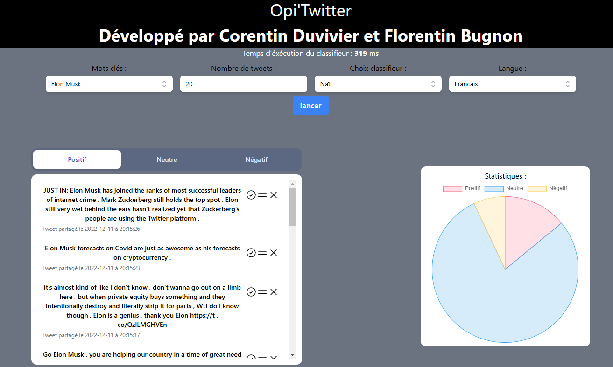

# PJE Twitter

*Dernière mise à jour : 24/12/2024*

Le projet est obsolète suite à des modifications de l'API Twitter.
L'API ne permet plus de récupérer des tweets dans la version gratuite.

Plus d'informations à cette adresse : https://developer.twitter.com/en/docs/twitter-api/getting-started/about-twitter-api

## Auteurs

- [Florentin Bugnon](https://github.com/Florenpain)
- [Corentin Duvivier](https://github.com/Xwooz)

## Description du projet

*Ce projet a été réalisé dans le cadre de l'UE "PJE" (Projet Encadré) de l'Université de Lille.*

L’objectif de ce projet est de construire une application qui récupère des tweets depuis Twitter, et d’en permettre l’analyse avec des algorithmes de machine learning afin d’en prédire une polarité:
- Positif
- Négatif
- Neutre

L’application est découpée en 2 parties :
- backend - Python, FastAPI

    Le back contient tout les algorithmes dont nous auront besoin, que ce soit pour la récupération des tweets via l'API de Twitter, 
    le nettoyage des données et aussi la classification des tweets.

- frontend - ReactJS

    Le front contient la vue, et les éléments avec lesquels l’utilisateur peut intéragir. 

## Aperçu

## Fonctionalités

* Récupération des tweets en fonction:
    * d'un mot clé
    * d'une langue
    * d'un nombre de tweets à récupérer
    * d'un classifieur
* Nettoyage des tweets récupérés grâce à des [regex](https://fr.wikipedia.org/wiki/Expression_r%C3%A9guli%C3%A8re)
* Classification des tweets récupérés grâce au classifieur choisi :
* Visualisation des tweets récupérés et classifiés avec un diagramme en camembert
* Visualisation des tweets récupérés et triés, avec la possibilité pour l'utilisateur d'annoter les tweets

## Utilisation

### Prérequis

* [Python 3.7.6](https://www.python.org/downloads/release/python-376/)
* [NodeJS 12.16.1](https://nodejs.org/en/download/)
* [make 4.2.1](https://www.gnu.org/software/make/)

*NB : Ne pas oublier de remplir le fichier backend/config/credentials.py avec vos tokens d'accès à l'API Twitter*

### Installation

#### Back

* Installer les dépéndances python : `make install-dep-back`
* Lancer le serveur : `make start-back`

#### Front

* Installer les dépendances : `make install-dep-front`
* Lancer le serveur : `make start-front`

